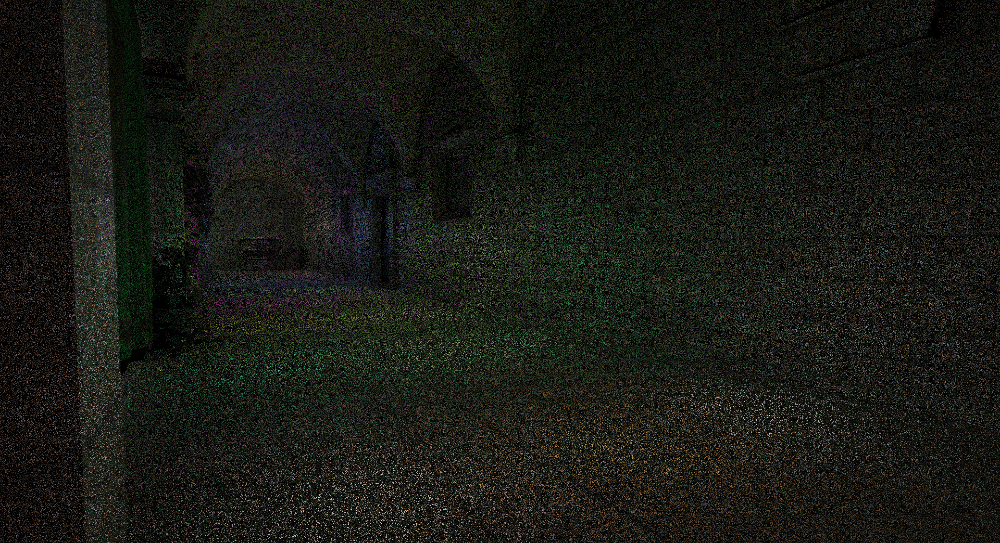

# ReSTIR-DI
A Vulkan renderer implementing the Reservoir-based Spatio-Temporal Importance Resampling algorithm; written as part of MSc thesis


## Building
### Windows
```bash
./premake5 vs2022
```

### Linux
```bash
./premake5 gmake2
make
./bin/Engine-release-x64-gcc.exe
```

<p align="center">
  <br>
  <em>RIS using WRS</em><br><br>

  <br>
  <em>Biased ReSTIR</em><br><br>

  <br>
  <em>Unbiased ReSTIR</em>
</p>


## Assets
Find the Sponza GLTF https://github.com/KhronosGroup/glTF-Sample-Assets/tree/main/Models/Sponza

[Sponza] (https://github.com/KhronosGroup/glTF-Sample-Assets/tree/main/Models/Sponza) GLTF

